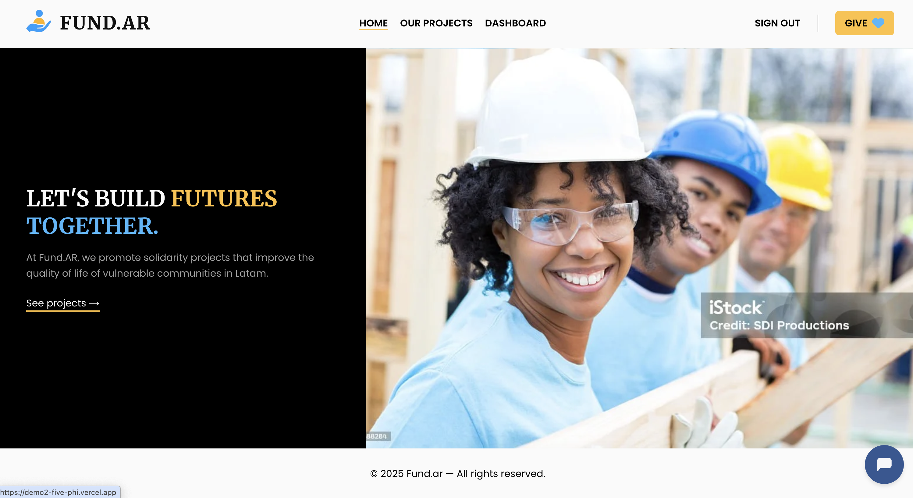
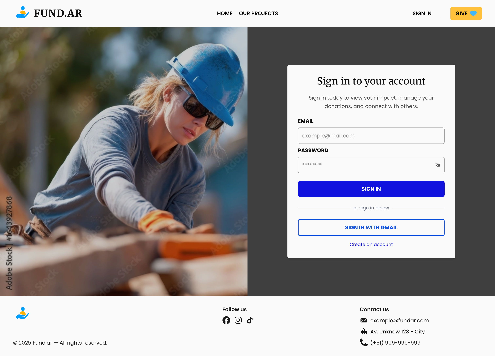
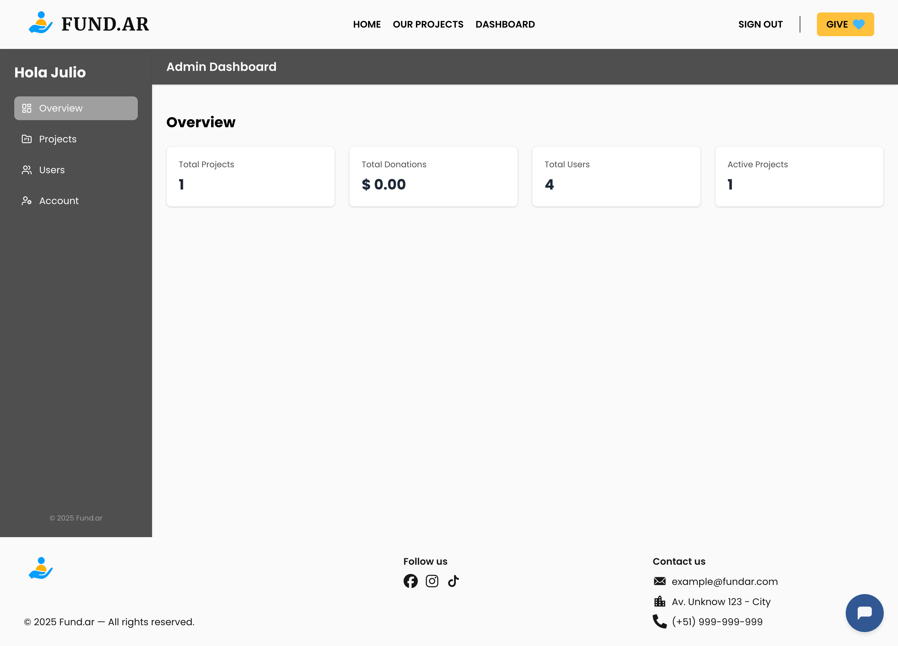

# 🌱 Fund.ar – Plataforma de Donaciones Sociales

Fund.ar es una plataforma web diseñada para conectar causas sociales con personas dispuestas a colaborar.  
Permite visualizar campañas, donar de forma segura, gestionar usuarios y administrar proyectos desde un panel especializado.

Este proyecto fue desarrollado como parte del **Final Project – Henry Bootcamp**, en un equipo de 01 frontend y 01 backend.  
Yo participé como **Frontend Developer**.

---

## 🚀 Demo en vivo

🔗 [Ver sitio desplegado en Vercel](https://demo2-five-phi.vercel.app/)

---

## 🧠 Funcionalidades principales

- ✅ Visualización de campañas activas
- ✅ Donaciones únicas con Stripe
- ✅ Registro/login con cuenta propia o Google OAuth
- ✅ Panel de usuario con historial de donaciones
- ✅ Panel de administrador con gestión de usuarios y proyectos
- ✅ Subida de imágenes a Cloudinary
- ✅ Envío de emails automáticos
- ✅ Chatbot básico integrado
- ✅ Responsive design para desktop, tablet y móvil

---

## 🛠️ Tecnologías utilizadas

### **Frontend**

- ⚛️ Next.js
- ✨ React
- 🎨 Tailwind CSS
- 🔐 JWT Authentication
- 🔐 Google OAuth2
- 🧠 Context API
- 📦 Vercel (Deploy)

### **Backend**

- 🟩 Node.js + Express
- 🐘 PostgreSQL
- 🔗 Sequelize / Prisma
- ✉️ Nodemailer
- ☁️ Cloudinary
- ⏰ Cron Jobs (`node-cron`)
- 📦 Render (Deploy)

---

## 🖼️ Capturas del sitio

| Página de inicio           | Login                      | Register                         |
| -------------------------- | -------------------------- | -------------------------------- |
|  |  |  |

| Dashboard Admin Overview                               | Dashboard Admin Projects            |
| ------------------------------------------------------ | ----------------------------------- |
|  |  |

---

## 📁 Estructura del frontend

```bash
frontend/
├── public/                    # Recursos estáticos
├── src/
│   ├── app/                   # Rutas (App Router)
│   ├── components/           # Componentes reutilizables
│   ├── context/              # Context API
│   ├── helpers/              # Funciones de utilidad
│   ├── interfaces/           # Tipado global (TypeScript)
│   ├── services/             # Peticiones HTTP y lógica externa
│   ├── utils/                # Validaciones y helpers extra
│   └── validators/           # Validación de formularios
└── proxy.ts                  # Configuración de proxy para API


### 📨 **Notificaciones automáticas**

- Emails de bienvenida.
- Confirmación de donaciones.
- Report de proyectos (cron jobs).
```
